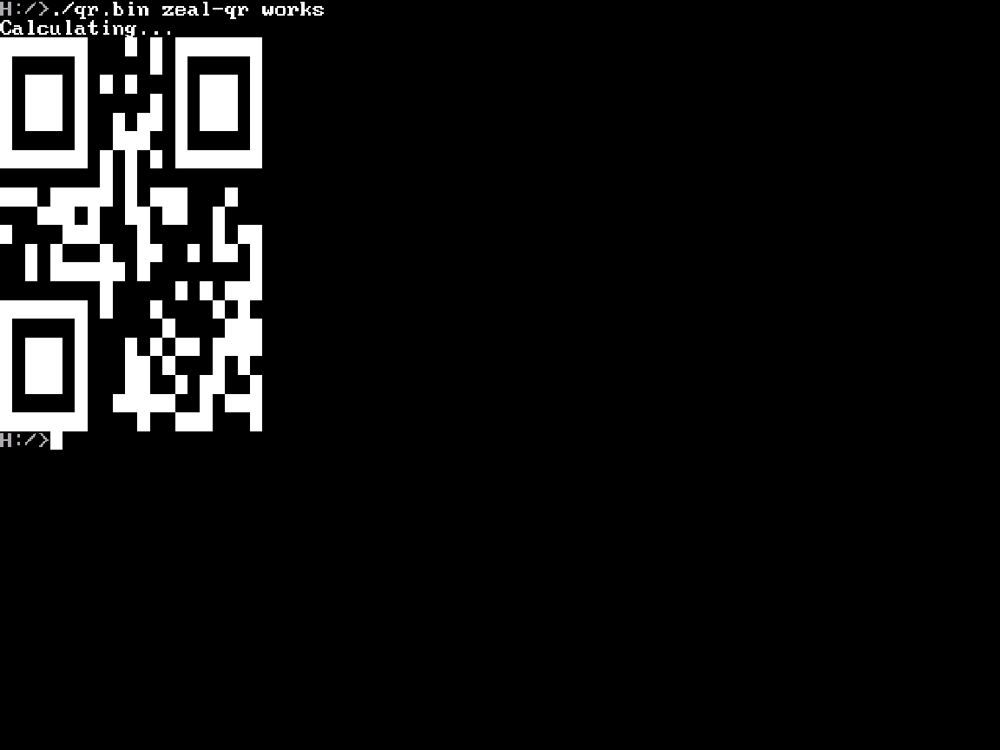

# zeal-qr

Zeal QR is a QR Code generator for Zeal 8-bit Computer.




This project is heavily inspired by the article, "[Displaying QR codes on 8-bit hardware](https://8bitworkshop.com/docs/posts/2022/8bit-qr-code.html)" from [Steven Hugg](https://github.com/sehugg) on [8bitworkshop.com](https://8bitworkshop.com/)

## Usage

```sh
./qr.bin ZEAL8BIT.COM
```

## Building from source

Make sure that you have [ZDE](https://github.com/zoul0813/zeal-dev-environment) installed.

Then open a terminal, go to the source directory and type the following commands:

```shell
    $ cd {project}
    $ zde make
```
